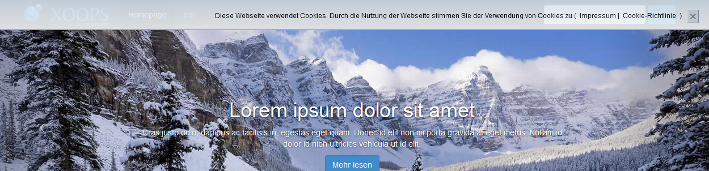
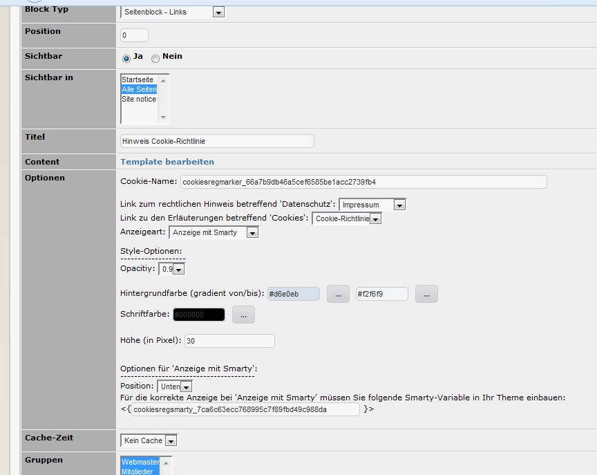

# 6. Blöcke

wgSitenotice bietet folgende Blöcke an:

## 6.1 Block mit einer Liste von Links auf die rechtlichen Hinweise

Beispiel:

## 6.2 Block Cookie-Richtlinie
Wenn ein Bootstrag-Theme verwendet wird, wird der Hinweis auf die Cookie-Richtline je nach Einstellung statisch oben oder unten auf der Webseite angezeigt. 

Beispiel Ansicht Hinweis auf Webseite Statisch oben:

In den Blockeinstellungen können z.B. die Hintergrundfarbe, Schriftfarbe usw. geändert werden.
Es wird außerdem empfohlen, einen Link auf die Datenschutzbestimmungen sowie zu den Erläuterungen für Cookies zu setzen

Beispiel Ansicht Blockeinstellungen:

