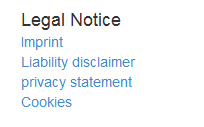
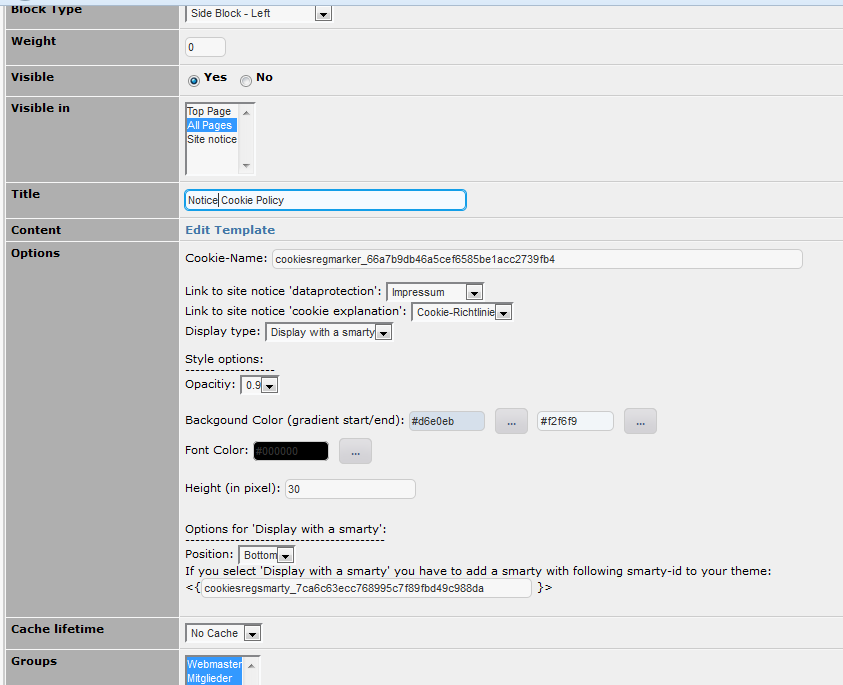

# 6.0 Blocks

wgSitenotice offers following blocks:

## 6.1 Block with a link list for all legal notices

Example:

## 6.2 Block Cookie-Regulation
If you use a bootstrap theme, the notice concerning cookie policy will be, depending on your settings, static on top or on bottom of your website displayed.

Example Notice on website static top:

In the block settings you can additionally manage e.g. background color, font color, and so on.
It is also recommended to set a link for data protection and explanation for cookies.

Example block settings:

